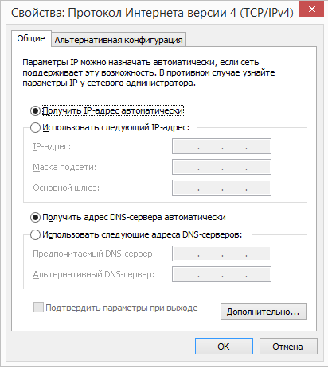

# Настройка машинок

Запомните правило работы с OrangePI:
>Всё подключил, потом включил!


## Оглавление
- [Ссылки на образы](#Выбираем-и-скачиваем-образ)
- [Инструкция Windows](#На-Windows)
	- [Скачаем проги](#Скачаем-проги)
	- [Настроим сеть](#Настроим-сеть)
	- [Раскатаем образ](#Раскатаем-образ)
	- [Подключимся](#Подключимся)
- [Инструкция Linux](#На-Linux)
	- [Раскатаем образ](#Раскатаем-образ-1)
	- [Настроим компьютер](#Настроим-компьютер)
	- [Подключимся](#Подключимся-1)
- [Настройка](#Настройка)
- [Подключение по SFTP](#Подключение-по-SFTP)

## Выбираем и скачиваем образ
- [armbian](https://www.armbian.com/orange-pi-zero/)
- [lubuntu](http://www.orangepi.org/downloadresources/orangepizero/2017-05-11/orangepizero_7f7ec2c4c22d7bd4d0d5fab.html)

## На Windows

### Скачаем проги

- [Win32 Disc Imager](https://sourceforge.net/projects/win32diskimager/)
- [SD Card Foramatter](https://www.sdcard.org/downloads/formatter/)
- [Putty](https://www.chiark.greenend.org.uk/~sgtatham/putty/latest.html)
- [Wireshark](https://www.wireshark.org/download.html)

### Настроим сеть

1. В настройках подключения по Ethernet включаем автоматическое назначение IPv4

	

2. В настройках подключения по беспроводной сети открываем доступ в интернет из сети Ethernet

	

3. На комп в сети Ethernet будет назначен IP `192.168.X.1`. Стоит запомнить этот адрес

### Раскатаем образ

1. Вставляем карту в комп
2. Форматируем с помощью _SD Card Formatter_
3. Открываем _Win32 Disk Imager_, выбираем нужный образ, нажимаем `Write`
4. Ждём, пока образ запишется на карту
5. Вставляем карту в **ВЫКЛЮЧЕННУЮ!** машинку

### Подключимся

1. Подключаем Ethernet кабель к **ВЫКЛЮЧЕННОЙ!** машинке
2. Открываем _Wireshark_ и начинаем слушать Ethernet
3. Подаём питание на машинку
4. Ждём, пока в _Wireshark_ не появится адрес машинки. Он будет как адрес компа, только на конце не `1` и не `255`
5. Открываем _Putty_
6. Выбираем тип подключения *SSH*, вводим адрес машинки, нажимаем *Открыть*

#### Породолжение в пункте [Настройка](#Настройка)

## На Linux


### Раскатаем образ

<http://www.microdev.it/wp/en/2016/07/11/sd-card-setup-for-orange-pi-pc-armbian-in-linux/>

### Настроим компьютер

1. Настраиваем статический ip адрес на Orange Pi:
	1. Вставляем SD карту в компьютер (здесь предполагается, что вы все еще используете Linux)
	2. Смотрим какое имя ядро назначило нашей SD карте
		- Можно воспользоваться:
			```
			fdisk -l
			```
	3.  __*Острожно!* Важно не перепутать с именем, назначенным для нашей системы__
	4. Допустим, SD карта получило имя `/dev/sda`, переходим в образ на карте
		```
		cd /dev/sda
		```
	5. Делаем как в пункте _[Настройка](#Настройка).Шаг 4_
	6. В файле `/etc/resolv.conf` добавляем DNS сервера (порядок = приоритет) следующим образом
	```
	nameserver x.x.x.x
	nameserver y.y.y.y
	```
	7. `umount /dev/sda`
	8. Вынимаем SD карту и вставляем обратно
2. Настраиваем компьютер на Linux:
	1. Настраиваем статический адрес на интерфейсе, с которым мы соединяем Orange PI, допустим у нас это `eth0`:
		- Если хотим, чтобы интерфейс после перезагрузки сохранил статический адрес, то делаем как в пункте _[Настройка](#Настройка).Шаг 4_
		- Если хотим, чтобы статический адрес был сброшен после перезагрузки, то пишем
		```
		ifconfig eth0 *ip адрес*/*длина префикса маски*
		```
		или
		```
		ifconfig eth0 *ip адрес* netmask *маска сети*
		```
	2. Включаем маршрутизацию
	```
	echo 1 > /proc/sys/net/ipv4/ip_forward
	```
	3. Пусть:
	- `eth0` - интерфейс, соедиенный с Orange Pi,
	- `wlan0` - интерфейс, имеющий доступ к Интернету

	4. Разрешаем трафик между интерфейсами
	```
	iptables -A FORWARD -i eth0 -o wlan0 -j ACCEPT
    iptables -A FORWARD -i wlan0 -o eth0 -m state --state ESTABLISHED,RELATED -j ACCEPT
	```
	5. Включаем маскарад (NAT)
	```
	iptables -t nat -A POSTROUTING -o wlan0 -j MASQUERADE
	```

### Подключимся
1. ssh root@\*orange pi ip\*

## Настройка

1. Вводим логин/пароль
	- armbian: root/1234
	- lubuntu: orangepi/orangepi
2. Меняем логин и пароль
3. Расширяем файловую систему на всё пространство:

	```
	$ fs_resize
	```

4. Настраиваем статический IP. Открываем файл `/etc/network/interfaces` и пишем в него, в конец:

	```
	auto eth0
	iface eth0 inet static
	address *ip машинки*
	netmask 255.255.255.0
	network *адрес сети*
	gateway *адрес компа*
	```

5. Перезагружаем

	```
	$ reboot
	```

6. Переподключаемся по прописанному ip к юзеру которого прописали
7. Обновляемся:

	```
	$ sudo apt update
	$ sudo apt upgrade
	```

8. Ставим нужные пакеты:

	```
	$ sudo apt-get install *имя пакета*
	```

	>gcc
	>
	>g++
	>
	>gdb
	>
	>peda-arm
	>
	>ntfs-3g
	>
	>cifs-utils
	>
	>krusader
	>
	>python3

9. Вы пришли к успеху!
10. Выключаем любой из 2 команд:
	```
	$ sudo halt
	```
	или
	```
	$ sudo shutdown now
	```


___

## Подключение по SFTP

### Windows

1. Скачиваем [WinSCP](https://winscp.net/eng/download.php)
2. Устанавливаем
3. Запускаем
4. Вводим адрес, имя пользователя и пароль

### Linux

```
$ sftp user host
```
